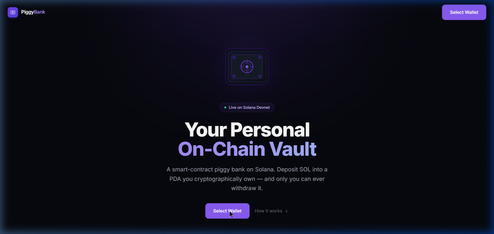
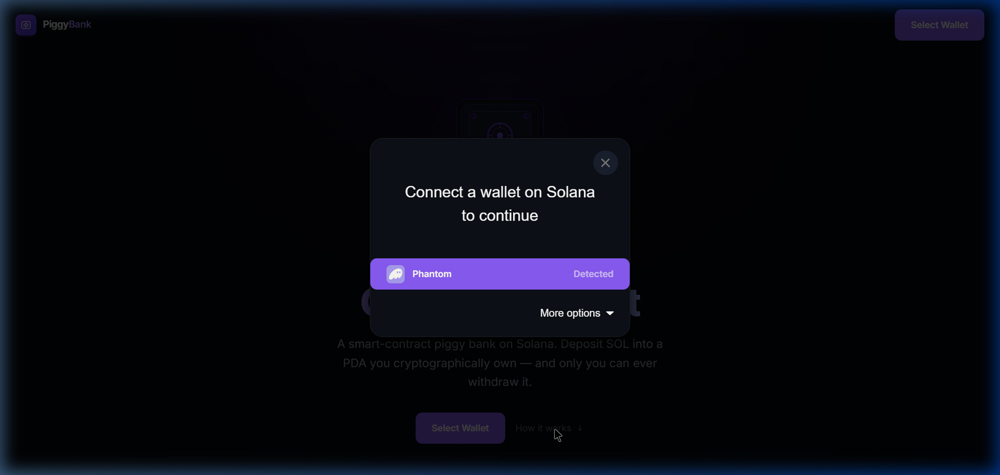
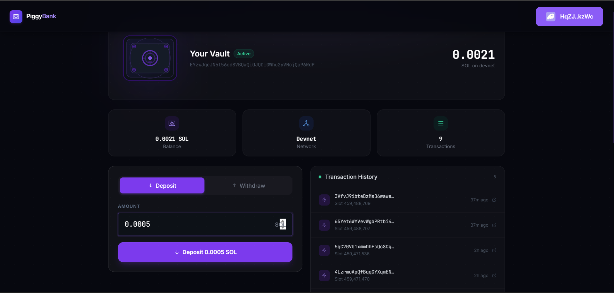
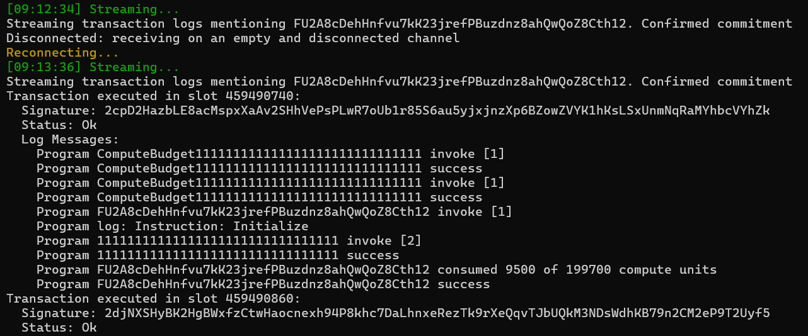
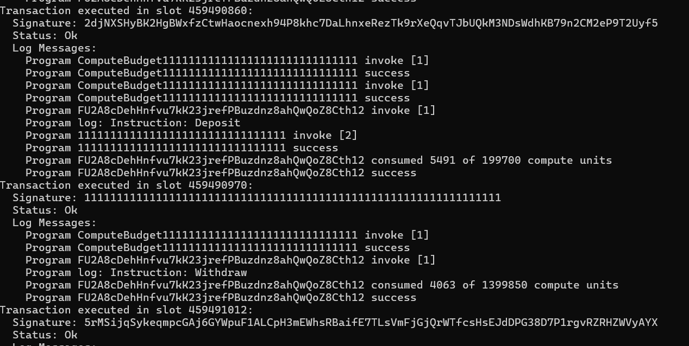

# 🐷 PiggyBank — On-Chain SOL Vault on Solana

> A fully-functional on-chain piggy bank built with the **Anchor framework** on **Solana Devnet**.  
> Any wallet can create its own piggy bank PDA, deposit SOL into it, and withdraw SOL back —  
> all rules enforced by an immutable smart contract deployed on Solana.

<div align="center">


**Program ID:** `FU2A8cDehHnfvu7kK23jrefPBuzdnz8ahQwQoZ8Cth12`  
[View on Solana Explorer](https://explorer.solana.com/address/FU2A8cDehHnfvu7kK23jrefPBuzdnz8ahQwQoZ8Cth12?cluster=devnet)

</div>

---

## 📑 Table of Contents
1. [Project Overview](#-project-overview)
2. [Real-World Analogy](#-real-world-analogy)
3. [Key Solana Concepts Used](#-key-solana-concepts-used)
4. [Architecture & How It Works](#-architecture--how-it-works)
5. [Folder Structure](#-folder-structure)
6. [Program Instructions](#-program-instructions)
7. [Account Layout](#-account-layout)
8. [Security & Ownership Enforcement (Bonus)](#-security--ownership-enforcement-bonus)
9. [Custom Errors](#-custom-errors)
10. [Prerequisites & Installation](#-prerequisites--installation)
11. [Step-by-Step Setup](#-step-by-step-setup)
12. [Running the Tests](#-running-the-tests)
13. [Test Suite Explained](#-test-suite-explained)
14. [Expected Test Output](#-expected-test-output)
15. [Deployment Details](#-deployment-details)
16. [Technical Deep-Dive](#-technical-deep-dive)
17. [Screenshots](#-screenshots)
18. [Live Terminal Logs](#-live-terminal-logs)
19. [Debugging Tips](#-debugging-tips)
20. [Resources](#-resources)
21. [Submission Checklist](#-submission-checklist)

---

## 🎯 Project Overview
This project implements a **Piggy Bank smart contract** on the Solana blockchain using the **Anchor framework**. It demonstrates core Solana programming model concepts: accounts, programs, instructions, PDAs (Program Derived Addresses), transactions, `invoke`, and direct lamport manipulation.

| Item                    | Value                                              |
| ----------------------- | -------------------------------------------------- |
| **Network**             | Solana Devnet                                      |
| **Program ID**          | `FU2A8cDehHnfvu7kK23jrefPBuzdnz8ahQwQoZ8Cth12`    |
| **Framework**           | Anchor 1.0.1                                       |
| **Language (on-chain)** | Rust                                               |
| **Language (tests)**    | JavaScript                                         |
| **Test runner**         | Mocha                                              |
| **Frontend**            | Next.js 14 + @coral-xyz/anchor 0.32.1              |

---

## 🏦 Real-World Analogy
| Physical World           | Solana Blockchain                                                              |
| ------------------------ | ------------------------------------------------------------------------------ |
| A physical piggy bank    | A **PDA account** owned by the program                                         |
| Who owns the bank        | Seeds `["piggybank", wallet_pubkey]` — only your wallet derives your bank      |
| Dropping coins in        | `deposit` instruction — SOL moves from your wallet → PDA                       |
| The coins inside         | **Lamports** stored inside the PDA                                             |
| Proof it's your bank     | PDA is deterministically derived from your public key                          |
| The bank's rules         | This on-chain Anchor program (immutable once deployed)                         |
| Walking up to the bank   | TypeScript/JS client building and sending a transaction                        |
| The teller processing it | Solana validators executing the instruction                                    |
| Breaking the piggy bank  | `withdraw` instruction — SOL moves from PDA → your wallet                      |

---

## 🔑 Key Solana Concepts Used

### Accounts
Every piece of data on Solana lives in an **account**. Accounts hold lamports (SOL), data, and have an owner program. In this project:

- The **user wallet** is an account owned by the System Program
- The **PDA** (`PiggyBank`) is an account owned by our Anchor program
- The **System Program** is a special built-in account that handles SOL transfers

### Programs
Programs are Solana's equivalent of smart contracts — stateless executable code stored on-chain. Our Anchor program contains three instructions (`initialize`, `deposit`, `withdraw`) and enforces all the rules.

### Instructions
Instructions are the actions a program can perform. Each instruction specifies which accounts are involved and what data is passed. A **transaction** bundles one or more instructions and is submitted atomically.

### PDAs (Program Derived Addresses)
A PDA is an account address derived from:

- A set of **seeds** (byte strings)
- The **program ID**
- A **bump** (a nonce that ensures the address doesn't fall on the ed25519 curve — i.e., has no private key)

In our program:

```
PDA = findProgramAddress(["piggybank", user_pubkey], program_id)
```

Since a PDA has no private key, **only the program itself can sign for it** — which is why direct lamport manipulation is used for withdrawals.

### invoke vs Direct Lamport Manipulation
|                 | `invoke`                                                   | Direct Lamport Manipulation                                              |
| --------------- | ---------------------------------------------------------- | ------------------------------------------------------------------------ |
| **Used for**    | Calling System Program when a real keypair is the signer   | Moving SOL out of a program-owned PDA                                    |
| **In our code** | `deposit` — user wallet signs                              | `withdraw` — PDA is program-owned, not System Program-owned              |
| **Why**         | User wallet is System Program-owned                        | Our PDA is program-owned; System Program has no authority over it        |

### Bump Seed
The bump is stored in the `PiggyBank` account so it doesn't need to be re-computed every time. This is a **gas optimization** — re-deriving the bump on-chain costs compute units.

---

## 🏗️ Architecture & How It Works

```
┌─────────────────────────────────────────────────────────────────┐
│                      CLIENT (Next.js 14)                         │
│  @solana/wallet-adapter + @coral-xyz/anchor                      │
│  anchor.methods.initialize() / deposit() / withdraw()            │
└────────────────────────────┬────────────────────────────────────┘
                             │ Transaction (JSON-RPC / devnet)
                             ▼
┌─────────────────────────────────────────────────────────────────┐
│                     SOLANA DEVNET VALIDATOR                      │
│  Validates signatures, checks account ownership, runs program    │
└────────────────────────────┬────────────────────────────────────┘
                             │
                             ▼
┌─────────────────────────────────────────────────────────────────┐
│               OUR ANCHOR PROGRAM (lib.rs)                        │
│  Program ID: FU2A8cDehHnfvu7kK23jrefPBuzdnz8ahQwQoZ8Cth12       │
│                                                                  │
│  initialize ──► Creates PDA, stores owner + bump                 │
│  deposit    ──► invoke(System::transfer, user→PDA)               │
│  withdraw   ──► Direct lamport manipulation (PDA→user)           │
└──────────────┬──────────────────────────────────────────────────┘
               │
               ▼
┌──────────────────────────────┐
│  PiggyBank PDA Account        │
│  Seeds: ["piggybank", user]   │
│  Data:  { owner, bump }       │
│  Lamports: deposited SOL      │
└──────────────────────────────┘
```

### Transaction Flow — Deposit
```
User Wallet  ──[sign]──►  Transaction
                              │
                              ▼
                    System Program::transfer
                              │
              ┌───────────────┴───────────────┐
              ▼                               ▼
       user_lamports -= amount        pda_lamports += amount
```

### Transaction Flow — Withdraw
```
Program signs for PDA via seeds  ──►  Transaction
                                           │
                                           ▼
                             Direct lamport manipulation
                                           │
                     ┌─────────────────────┴─────────────────────┐
                     ▼                                           ▼
            pda_lamports -= amount                  user_lamports += amount
```

**Why can't another wallet withdraw?**

The PDA address is derived from `["piggybank", owner_pubkey]`. When a rogue wallet tries to sign a withdrawal:
1. Anchor computes the expected PDA using the signer's key → different address
2. `ConstraintSeeds` fails (error 2006) — the passed account ≠ computed address
3. Transaction is **rejected at consensus** — no lamports move

---

## 📁 Folder Structure

```
Blockquest-piggybank/
│
├── Anchor.toml                     # Cluster config (devnet), program ID, test script
├── Cargo.toml                      # Rust workspace config
├── package.json                    # JS dependencies (@coral-xyz/anchor, mocha)
├── tsconfig.json                   # TypeScript compiler config
├── README.md                       # This file
├── logs.ps1                        # Live log streaming script (PowerShell)
├── setup.bat                       # One-click Windows setup script
├── install-solana.ps1              # Solana CLI installer for Windows
├── .gitignore                      # Excludes target/, node_modules/, keypairs
│
├── programs/piggybank/
│   └── src/
│       └── lib.rs                  # ◄── ALL on-chain Rust program logic
│
├── tests/
│   └── piggybank.js                # ◄── All 4 JavaScript tests (Mocha)
│
├── screenshots/                    # App screenshots for README
│
├── target/                         # Auto-generated by `anchor build` — NOT committed
│   ├── deploy/piggybank.so         # Compiled BPF bytecode deployed to devnet
│   └── idl/piggybank.json          # Auto-generated Interface Definition Language
│
└── app/                            # Next.js 14 frontend
    └── src/
        ├── app/page.tsx            # Main page (3 states: hero / init / dashboard)
        ├── components/
        │   ├── Navbar.tsx
        │   ├── VaultVisual.tsx
        │   ├── DepositWithdrawPanel.tsx
        │   ├── TxFeed.tsx
        │   └── TerminalLog.tsx
        ├── hooks/usePiggyBank.ts   # Anchor client + state + log tracking
        ├── context/WalletContextProvider.tsx
        └── idl/piggybank.json      # IDL copy for frontend
```

---

## 🔧 Program Instructions

### 1. `initialize`
**Purpose:** Creates a new PDA piggy bank account for the calling user.

**How it works:**
- Derives a PDA using seeds `["piggybank", user_pubkey]`
- Allocates 41 bytes of on-chain space
- Stores the caller's public key as `owner`
- Stores the canonical `bump` seed for future verification
- The user pays the rent-exempt deposit (a one-time SOL cost to keep the account alive)

**Accounts required:**
```
piggy_bank     — the PDA to be created (init)
owner          — signer and payer
system_program — required for account creation
```

**Can only be called once per wallet** — Anchor's `init` constraint rejects any attempt to re-initialize an existing account.

---

### 2. `deposit(amount: u64)`
**Purpose:** Transfers `amount` lamports from the user's wallet into their piggy bank PDA.

**How it works:**
- Validates `amount > 0`
- Calls `system_instruction::transfer` via `invoke()` — a **Cross-Program Invocation (CPI)**
- The user wallet (owned by System Program) is the sender, so `invoke` is used
- The System Program verifies the user's signature and moves the lamports

---

### 3. `withdraw(amount: u64)`
**Purpose:** Moves `amount` lamports from the PDA back to the user's wallet.

**How it works:**
- Validates `amount > 0`
- Checks there are enough withdrawable lamports (balance minus rent-exempt minimum)
- Uses **direct lamport manipulation** because the PDA is owned by our program

```rust
**ctx.accounts.piggy_bank.to_account_info().try_borrow_mut_lamports()? -= amount;
**ctx.accounts.owner.to_account_info().try_borrow_mut_lamports()? += amount;
```

The runtime ensures the total lamports before and after the instruction are equal (conservation of lamports).

**Rent-exemption guard:** The program ensures the PDA always keeps enough lamports to stay rent-exempt. Solana purges accounts with insufficient lamports, which would destroy the piggy bank.

---

## 📐 Account Layout

```rust
#[account]
pub struct PiggyBank {
    pub owner: Pubkey,  // 32 bytes
    pub bump:  u8,      //  1 byte
}
// Total: 8 (discriminator) + 32 + 1 = 41 bytes
// Rent-exempt minimum: ~0.00117624 SOL
```

```
Offset  Size   Field
──────────────────────────────────────────
0       8      Anchor account discriminator (auto-added)
8       32     owner: Pubkey  — wallet that created this bank
40      1      bump: u8       — canonical bump seed
──────────────────────────────────────────
Total   41 bytes
```

The discriminator is a unique 8-byte hash of the account type name. Anchor uses it to verify you're reading the right type of account — prevents type confusion attacks.

---

## 🛡️ Security & Ownership Enforcement (Bonus)

The `Withdraw` instruction context includes an **explicit ownership constraint**:

```rust
#[derive(Accounts)]
pub struct Withdraw<'info> {
    #[account(
        mut,
        seeds  = [b"piggybank", owner.key().as_ref()],
        bump   = piggy_bank.bump,
        has_one = owner   // ← rejects any signer that isn't the vault owner
    )]
    pub piggy_bank: Account<'info, PiggyBank>,
    #[account(mut, signer)]
    pub owner: Signer<'info>,
    pub system_program: Program<'info, System>,
}
```

This creates **two independent layers of protection**:

**Layer 1 — Seeds constraint (automatic):**  
Anchor re-derives the PDA from `["piggybank", user.key()]` and checks it matches the provided `piggy_bank` address. If an attacker passes their own public key as `user`, the derived PDA won't match the victim's PDA → transaction rejected with `ConstraintSeeds` (error 2006).

**Layer 2 — `has_one` owner constraint:**  
The stored `owner` field inside the account data is checked against `user.key()`. If they don't match → transaction rejected.

**The 4th test proves this works:**
```
Attacker generates a fresh keypair
Attacker tries to withdraw from our PDA
→ REJECTED: ConstraintSeeds (2006)
```

This is **defence in depth** — two separate, independent checks.

---

## ❌ Custom Errors

| Error Code          | Anchor Code | Message                                                        |
| ------------------- | ----------- | -------------------------------------------------------------- |
| `ConstraintSeeds`   | 2006        | PDA re-derivation doesn't match provided account               |
| `InsufficientFunds` | Custom      | Withdrawal would violate rent-exemption                        |

---

## ⚙️ Prerequisites & Installation

| Tool               | Version Used  | Check Command       |
| ------------------ | ------------- | ------------------- |
| Rust (stable)      | 1.75+         | `cargo --version`   |
| Solana CLI         | v1.18+        | `solana --version`  |
| Anchor CLI (AVM)   | 1.0.1         | `anchor --version`  |
| Node.js            | 18+           | `node --version`    |
| npm                | 9+            | `npm --version`     |

> **Windows Users:** Use the included `setup.bat` or `install-solana.ps1` for a guided setup.

---

## 🚀 Step-by-Step Setup

### 1. Clone the repository
```bash
git clone https://github.com/<your-username>/Blockquest-piggybank.git
cd Blockquest-piggybank
```

### 2. Install JavaScript dependencies
```bash
npm install
```

### 3. Configure Solana for Devnet
```bash
solana config set --url devnet
solana-keygen new --outfile ~/.config/solana/id.json   # skip if you have a wallet
solana address    # shows your wallet public key
solana balance    # check your devnet SOL balance
```

### 4. Get devnet SOL (if balance is 0)
```bash
solana airdrop 2
# or use web faucets:
# https://faucet.solana.com
# https://faucet.quicknode.com/solana/devnet
```

### 5. Build the program
```bash
anchor build
# Compiles Rust → target/deploy/piggybank.so (~2-3 min first time)
```

### 6. Deploy to Devnet (already deployed — skip if using existing program)
```bash
anchor deploy --provider.cluster devnet
# Outputs: Program Id: FU2A8cDehHnfvu7kK23jrefPBuzdnz8ahQwQoZ8Cth12
```

### 7. Update Program ID (only if redeploying fresh)
If you get a new Program ID, update it in two places:

**`programs/piggybank/src/lib.rs`:**
```rust
declare_id!("YOUR_NEW_PROGRAM_ID");
```

**`Anchor.toml`:**
```toml
[programs.devnet]
piggybank = "YOUR_NEW_PROGRAM_ID"
```
Then rebuild: `anchor build`

### 8. Install frontend dependencies & start
```bash
cd app
npm install
npm run dev
# → http://localhost:3000
```

### 9. Watch live logs (separate PowerShell window)
```powershell
powershell -ExecutionPolicy Bypass -File logs.ps1
```

---

## 🧪 Running the Tests

```powershell
# Set environment variables (PowerShell)
$env:ANCHOR_PROVIDER_URL = "https://api.devnet.solana.com"
$env:ANCHOR_WALLET       = "$env:USERPROFILE\.config\solana\id.json"

# Run all 4 tests
npx mocha -t 1000000 tests/piggybank.js
```

The `-t 1000000` flag sets a generous timeout since devnet confirmation can be slow.

---

## 🔍 Test Suite Explained

### Test 1 — Initializes the piggy bank
- Derives the PDA deterministically from `["piggybank", user_pubkey]`
- Sends an `initialize` instruction
- Fetches the on-chain account and **asserts** `account.owner === user.publicKey`
- If the PDA already exists from a previous run, skips init and verifies the owner

### Test 2 — Deposits SOL
- Records PDA balance before the deposit
- Sends a `deposit` instruction with `0.1 SOL`
- Waits for confirmation
- Fetches PDA balance after and **asserts** it increased

### Test 3 — Withdraws SOL
- Records user wallet balance before withdrawal
- Sends a `withdraw` instruction with `0.05 SOL`
- Waits for confirmation
- Fetches user balance after and **asserts** it increased (minus small tx fee tolerance)

### Test 4 (Bonus) — Rejects unauthorized withdrawal
- Generates a fresh random keypair (the attacker)
- The attacker tries to call `withdraw` on **our PDA** with their key as `owner`
- **Asserts that the transaction throws** an error containing `ConstraintSeeds` (2006)
- Proves the on-chain ownership enforcement works correctly

---

## ✅ Expected Test Output

```
  piggybank
  ✓ Initializes the piggy bank (or verifies existing)  (438ms)
  ✓ Deposits 0.1 SOL and PDA balance increases         (865ms)
  ✓ Withdraws 0.05 SOL and user balance increases      (774ms)
  ✓ Unauthorized withdrawal fails with constraint error (185ms)

  4 passing (2s)
```

---

## 🌐 Deployment Details

| Field                 | Value                                                                                                                          |
| --------------------- | ------------------------------------------------------------------------------------------------------------------------------ |
| **Network**           | Solana Devnet                                                                                                                  |
| **Program ID**        | `FU2A8cDehHnfvu7kK23jrefPBuzdnz8ahQwQoZ8Cth12`                                                                                |
| **PDA Seeds**         | `["piggybank", owner_pubkey]`                                                                                                  |
| **Account Size**      | 41 bytes (8 discriminator + 32 pubkey + 1 bump)                                                                                |
| **Rent-exempt Min**   | ~0.00117624 SOL                                                                                                                |
| **Withdraw Method**   | Direct lamport manipulation (`try_borrow_mut_lamports`)                                                                        |
| **Access Control**    | `has_one = owner` + `ConstraintSeeds`                                                                                          |
| **Explorer Link**     | [View on Solana Explorer](https://explorer.solana.com/address/FU2A8cDehHnfvu7kK23jrefPBuzdnz8ahQwQoZ8Cth12?cluster=devnet)    |

---

## 🔬 Technical Deep-Dive

### Why PDAs have no private key
PDAs are derived by hashing the seeds + program ID. The hash is intentionally made to land **off** the ed25519 elliptic curve (by trying bump values from 255 down until it finds one that does). Since it's off the curve, it has no corresponding private key — only the program can authorize actions on it.

### Conservation of Lamports
Solana's runtime enforces that the **total lamports across all accounts in a transaction cannot change** (except for fees paid to validators). This is why direct lamport manipulation works safely — if we subtract from PDA and add to user, the total stays the same. The runtime will reject any transaction where lamports appear or disappear.

### Rent Exemption
Accounts on Solana pay **rent** for the storage they consume unless they hold enough lamports to be "rent-exempt" (~0.00117624 SOL for 41 bytes). Rent-exempt accounts persist forever. Our withdraw guard prevents the PDA from dropping below this threshold, which would cause it to be garbage-collected by the runtime.

### Anchor's Account Discriminator
When Anchor creates an account with `#[account]`, it prepends 8 bytes — a SHA256 hash of `"account:{TypeName}"`. On every instruction, Anchor verifies this discriminator matches the expected account type, preventing one account type from being substituted for another.

### Version Stack Used
```
Solana CLI:         v1.18+
Anchor CLI:         1.0.1
anchor-lang:        1.0.1 (Rust crate)
@coral-xyz/anchor:  0.32.1 (JS package)
Node.js:            18+
Next.js:            14
```

---

## 📸 Screenshots

### 1. Landing Page
Connect your Phantom wallet to get started. The hero explains exactly what a PDA vault is and why it's more secure than a regular wallet.



---

### 2. Wallet Connection
Click **Select Wallet** — Phantom is auto-detected. One click and you're in.



---

### 3. Live Dashboard — Active Vault
Once connected and initialized, the dashboard shows your vault balance, deposit/withdraw panel, and full transaction history.



---

### 4. Solana Live Logs — Terminal Output
A dedicated PowerShell window streams every on-chain instruction in real time using `solana logs`. Here you can see `Initialize`, `Deposit`, and `Withdraw` instructions firing with their compute units and transaction signatures.

> *Auto-reconnects on WebSocket timeout — no manual action needed.*




---

## 📡 Live Terminal Logs

The `logs.ps1` script streams every on-chain instruction as it executes:

```powershell
powershell -ExecutionPolicy Bypass -File logs.ps1
```

**What you'll see:**
```
[09:12:34] Streaming...
Transaction executed in slot 459490740:
  Signature: 2cpD2HazbLE8acMspxXaAv2SHhVePsPLwR7oUb1r85S6...
  Status: Ok
  Log Messages:
    Program FU2A8cDehHnfvu7kK23jrefPBuzdnz8ahQwQoZ8Cth12 invoke [1]
    Program log: Instruction: Initialize
    Program 11111111111111111111111111111111 invoke [2]
    Program 11111111111111111111111111111111 success
    Program FU2A8cDehHnfvu7kK23jrefPBuzdnz8ahQwQoZ8Cth12 consumed 9500 of 199700 compute units
    Program FU2A8cDehHnfvu7kK23jrefPBuzdnz8ahQwQoZ8Cth12 success

Transaction executed in slot 459490860:
    Program log: Instruction: Deposit
    ...consumed 5491 of 199700 compute units
    Program FU2A8cDehHnfvu7kK23jrefPBuzdnz8ahQwQoZ8Cth12 success
```

---

## 🔍 Debugging Tips

```bash
# Watch real-time program logs while running tests
solana logs FU2A8cDehHnfvu7kK23jrefPBuzdnz8ahQwQoZ8Cth12

# Check a specific transaction on Solana Explorer
# https://explorer.solana.com/tx/<SIGNATURE>?cluster=devnet

# Check your wallet balance
solana balance

# Get more devnet SOL
solana airdrop 2
# or visit https://faucet.solana.com
```

**Common issues:**

| Error | Cause | Fix |
|-------|-------|-----|
| `Blockhash not found` | Stale blockhash | Add `skipPreflight: true` to RPC options |
| `Custom: 0` on initialize | PDA already exists | Safe to ignore — tests handle this |
| `airdrop failed: Internal error` | Devnet rate limit | Use web faucet instead |
| `ConstraintSeeds (2006)` on withdraw | Wrong signer | Ensure connected wallet matches vault owner |

---

## 📚 Resources
- [Anchor Documentation](https://www.anchor-lang.com)
- [Anchor PDA Reference](https://www.anchor-lang.com/docs/pdas)
- [Solana Docs — Programming Model](https://docs.solana.com/developing/programming-model/overview)
- [Solana Docs — Accounts](https://docs.solana.com/developing/programming-model/accounts)
- [Solana Docs — Calling Between Programs (CPI)](https://docs.solana.com/developing/programming-model/calling-between-programs)
- [Solana Cookbook — PDAs](https://solanacookbook.com/core-concepts/pdas.html)
- [Solana Explorer (Devnet)](https://explorer.solana.com/?cluster=devnet)

---

## 📋 Submission Checklist
- [x] GitHub repository containing `programs/`, `tests/`, config files
- [x] Program deployed on Solana Devnet
- [x] Program ID correctly set in `declare_id!()` in `lib.rs`
- [x] Program ID correctly set in `Anchor.toml` under `[programs.devnet]`
- [x] **Test 1** — `initialize` passes ✔
- [x] **Test 2** — `deposit` passes ✔
- [x] **Test 3** — `withdraw` passes ✔
- [x] **Test 4 (Bonus)** — unauthorized withdrawal rejected ✔
- [x] All 4 tests passing: `4 passing` with no failures
- [x] `target/` excluded from git via `.gitignore`
- [x] Keypair files excluded from git via `.gitignore`
- [x] Next.js 14 frontend deployed and functional
- [x] Live terminal log streaming via `logs.ps1`
- [x] Screenshots included in `screenshots/`

---

<div align="center">
Built for Blockquest · Solana Devnet · Anchor Framework
</div>
